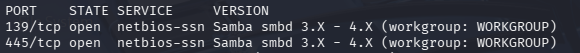

# 🛡️ Lab Red Team Vulnerabilidade SMB(Ports 139/445)

## 📌 Contexto da operação
Este repositório documenta uma simulação de operação de Red Team em ambiente controlado (Metasploitable 2), com foco na análise de um serviço SAMBA(SMB) exposto em rede interna.

A operação teve como objetivo simular a visão de um atacante real em ambiente corporativo, desde a descoberta inicial até a validação de impacto de uma configuração vulnerável.

---

## 🎯 Objetivo da simulação
- Mapear superfície de ataque da máquina alvo
- Identificar serviços expostos e suas versões
- Avaliar possíveis vetores de comprometimento
- Validar hipóteses de exploração em ambiente controlado
- Traduzir achados técnicos em impacto de negócio

---

## 🧪 Ambiente da operação
- **Alvo:** Metasploitable 2
- **Máquina de análise:** Kali Linux
- **Rede:** laboratório virtual isolado
- **Escopo:** totalmente restrito e autorizado

---

## 🔎 Fase 1 – Reconhecimento
Durante o processo inicial de reconhecimento, foi identificado um host ativo com múltiplos serviços expostos na rede.

Entre eles, destacaram-se os serviços SMB ativos nas portas **139/TCP** e **445/TCP**, protocolos amplamente utilizados em ambientes corporativos para compartilhamento de arquivos, autenticação e comunicação interna.

---

## 🧾 Fase 2 – Enumeração
A enumeração do serviço revelou informações relevantes sobre sua superfície de ataque:

- Serviço SMB ativo e acessível na rede interna
- Identificação de versão do serviço
- Indícios de configuração legada
- Potencial exposição desnecessária de serviços críticos
- Possível presença de componentes historicamente associados a vulnerabilidades conhecidas

---

## ⚔️ Fase 3 – Validação de exploração (simulada)
Durante a simulação de exploração em ambiente isolado, foi validada a hipótese de comprometimento através de uma vulnerabilidade conhecida associada ao serviço SMB identificado.

A validação confirmou que uma configuração insegura poderia permitir execução não autorizada de ações no host alvo sob condições específicas.

Nenhum detalhe técnico operacional é exposto neste relatório, pois o objetivo é demonstrar metodologia, análise de risco e visão ofensiva, não reprodução de exploração.

---

## 📊 Impacto simulado
Caso o mesmo cenário estivesse presente em ambiente corporativo real, os impactos potenciais poderiam incluir:

- Comprometimento do host alvo
- Execução não autorizada de comandos
- Acesso indevido a recursos internos
- Exposição de dados compartilhados
- 
---

## 🧠 Visão de atacante (Red Team insight)
A análise reforça um ponto crítico:

Serviços internos considerados "confiáveis" frequentemente se tornam vetores de comprometimento quando versões legadas permanecem expostas sem necessidade operacional clara.

Em ambientes corporativos, a combinação de exposição interna + software desatualizado pode permitir comprometimentos com baixo nível de complexidade técnica.

---

## 🚨 Nota de segurança
Toda a atividade descrita foi realizada exclusivamente em ambiente controlado e isolado, sem qualquer interação com sistemas reais.

---

## 📸 Evidências

**Identificação do serviço SMB durante a fase de reconhecimento

